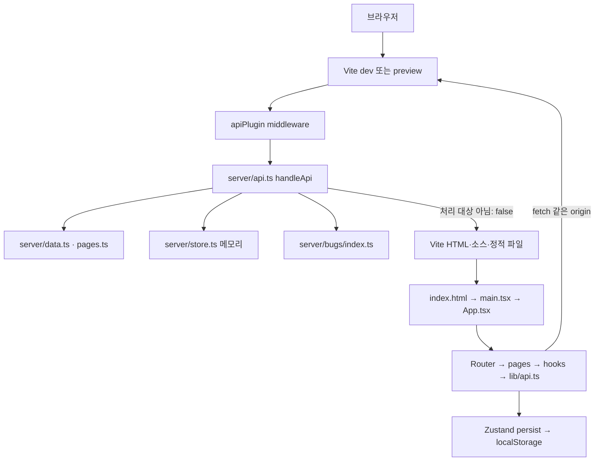

# 아키텍처와 데이터 흐름

분석일: 2026-10-08. 정적 코드 확인 문서이며 실행 관찰 결과가 아니다. 전체 화면 목록은 [PROJECT_OVERVIEW.md](PROJECT_OVERVIEW.md), 운영 절차는 [SERVER_SETUP.md](SERVER_SETUP.md)를 참조한다.

## 단일 프로세스 구조



`vite.config.ts`가 `apiPlugin()`을 등록한다. `server/vite-plugin-api.ts`의 `configureServer`와 `configurePreviewServer`는 같은 middleware를 연결한다. middleware는 `import('./api')` 후 `handleApi(req,res)`를 호출하고 false면 next()로 넘긴다. API 실행 중 예외는 JSON 500으로 응답한다. 단, 동적 import 자체는 try 바깥이므로 import 실패까지 그 catch가 처리한다고 볼 수는 없다.

동적 import를 매 요청 호출해도 모듈 캐시 무효화가 구현되어 있지는 않다. 주석의 “수정이 재시작 없이 반영”은 보장하지 말고 백엔드 변경 후 프로세스를 재시작한다.

## HTTP 요청 처리

1. `handleApi`가 URL pathname을 구한다. `/api/` 접두사, 정확한 `/_reset`, `/gt.json`만 처리 대상으로 삼는다.
2. `/_reset`은 `reset(priceOf)` 후 200, `/gt.json`은 `groundTruth()` 후 200이다. 두 분기는 지연 전에 실행되며 **HTTP 메서드를 검사하지 않는다**. 사용 규약은 각각 POST/GET이다.
3. 일반 API는 기본 250ms sleep 후 경로·메서드 분기로 처리한다. `/api/health`도 메서드 검사가 없다.
4. POST/PATCH 본문은 `readBody` → JSON.parse → 분기별 검증이다. `currentUser`는 `parseCookies` → `userForToken`을 호출한다.
5. `json`이 상태·JSON content-type·cache-control:no-store를 설정한다. 일치하지 않는 API 요청은 404 `{error:'not_found',path}`로 끝난다(405 전용 처리 없음).
6. 화면 요청 `/product/...` 등은 API 처리 대상이 아니다. Vite가 SPA 진입점을 제공하고 React Router가 화면을 결정한다. UI의 “404”와 HTTP 상태 404는 구분해야 한다.

## API 계약

모든 업무 엔드포인트 구현은 `server/api.ts`의 `handleApi` 안에 있다. 표는 메서드·경로 조합 23개(/_reset, /gt.json 포함)다. 예외 입력 전체를 열거한 완전한 스키마는 아니다.

| 메서드·경로 | 입력 / 처리 함수 | 정상 응답 / 주요 오류 |
|---|---|---|
| GET /api/health | product/user/order 수 | 200 `{ok,products,users,orders}`; 실제 메서드 제한 없음 |
| GET /api/bugs | enabledIds | 200 `{enabled: string[]}` |
| GET /gt.json | groundTruth | 200 generatedAt/total/enabled/byArea/bySymptom/detectable/defects; 메서드 제한 없음 |
| POST /_reset | reset(priceOf) | 200 `{ok,users,orders}`; 메서드 제한 없음 |
| GET /api/collections | collections | 200 `{items,total}` |
| GET /api/products | q, collection, sort, limit, featured=1, new=1 | 200 `{items,total,query?}`; 없는 collection 404 |
| GET /api/products/:slug | slug 조회 | 200 Product; 없는 상품 404 |
| GET /api/products/:slug/related | base slug, limit 기본 4 | 200 `{items,total}`; 없는 base 404 |
| POST /api/auth/signup | name/email/password | 201 `{user}` + 쿠키; 누락/이메일/8자 미만 400, 중복 409 |
| POST /api/auth/login | email/password, verifyPassword | 200 `{user}` + 쿠키; 누락 400, 자격 불일치 401 |
| POST /api/auth/logout | 쿠키 → destroySession | 200 `{ok:true}` + 쿠키 삭제 |
| GET /api/auth/me | currentUser | 200 `{user}`; 비로그인은 `{user:null}` |
| PATCH /api/auth/me | name → updateUserName | 200 `{user}`; 비로그인 401, 빈 이름 400 |
| POST /api/auth/password | currentPassword/newPassword | 200 `{ok:true}` + 새 세션; 인증/현재 암호 401, 약한/같은 암호 400 |
| POST /api/auth/forgot | email → createResetToken | 200 `{ok,resetUrl}`; 없는 계정은 resetUrl=null; 잘못된 이메일 400 |
| GET /api/auth/reset | token → userForResetToken | 200 `{email}`; 무효·만료·사용 완료 400 |
| POST /api/auth/reset | token/password | 200 `{user}` + 새 쿠키; 누락·약한 암호·무효 토큰 400 |
| GET /api/pages | listInfoPages | 200 `{items,total}`; 본문 sections 제외 |
| GET /api/pages/:slug | findInfoPage | 200 InfoPage; 없는 페이지 404 |
| POST /api/subscribe | email 검증 | 202 `{ok,email}`; 누락/형식 400. 저장·메일 전송 없음 |
| GET /api/orders | currentUser → listOrdersByUser → expandOrder | 200 `{items,total}`; 비로그인 401 |
| GET /api/orders/:id | findOrderById, 소유자 확인, expandOrder | 200 Order; 없음 404, 로그인 필요 401, 다른 사용자 403 |
| POST /api/orders | items:[{productId,quantity}], customer | 201 `{orderId,total,shipping}`; 빈 cart/필수값 400, 상품 없음 422 |

JSON 파싱 실패는 해당 분기에서 400 invalid_json이다. 그러나 JSON 값의 모든 런타임 타입을 검증하지 않으므로 잘못된 타입은 예외로 500을 유발할 수 있다.

## 상품·검색·정렬

원본 상품 13개와 컬렉션 8개는 `server/data.ts`, 브라우저의 타입·컬렉션 메타데이터는 `src/data/products.ts`다. 컬렉션은 양쪽에 중복 정의되어 동기화가 필요하다. `/api/collections`가 있어도 Header/Footer/SearchDialog 등은 브라우저 정적 컬렉션을 사용한다.

목록은 `matchesQuery`로 이름/설명/긴 설명/소재/컬렉션명을 소문자로 합쳐 공백으로 나눈 모든 검색어를 AND 매칭한다. collection slug를 id로 해석해 필터링하고 featured/new 필터를 적용한 뒤 `sortProducts`를 호출한다. total은 limit 적용 전 수다. featured와 newest는 해당 boolean 플래그 우선이며 등록일 기반 정렬이 아니다. 알 수 없는 sort는 featured로 fallback한다. 연관 상품은 같은 collection, 자기 자신 제외이며 total도 잘라낸 결과 수다.

`Products.handleFilterChange/handleSortChange/handleClearSearch`는 다른 쿼리를 보존하며 URL을 변경한다. `useProducts`의 queryKey는 `["products",q]`여서 조건 변경 시 새 조회를 한다.

## 인증 및 주문 흐름

`store.ts`는 users/orders 배열, sessions/resetTokens Map, 순번을 관리한다. 비밀번호는 임의 salt와 Node scrypt로 해시하고 timingSafeEqual로 비교한다. `publicUser`는 id/email/name만 반환한다. 쿠키는 `maison_session`, Path=/, HttpOnly, SameSite=Lax, Max-Age=86400이다. Secure는 설정하지 않는다. 쿠키 만료 시간과 별개로 서버 sessions Map에는 TTL 검사가 없다.

재설정 토큰은 생성 후 30분, 조회 시 만료 검사, 성공 후 consumeResetToken으로 1회 사용 제한한다. 암호 변경/재설정은 destroyUserSessions 후 본인용 새 세션을 발급한다. 메일 연동 대신 응답 resetUrl로 링크를 전달하는 데모 구조다. 문서·테스트 로그에는 비밀번호와 토큰 원문을 남기지 않는다.

주문:

```text
ProductDetail.handleAddToCart
  → useCart.addItem(product, quantity) → localStorage
Cart → Checkout.handleSubmit
  → api.post('/api/orders', {items: id·수량, customer})
  → handleApi: 빈 목록·고객 필수값·상품 id 확인
  → 서버 원본 가격 × 수량, 배송비 계산
  → currentUser → createOrder(userId 또는 null)
  → 201 → clearCart → 성공 토스트 → /order/:orderId
  → useOrder → GET /api/orders/:id → expandOrder → 주문 화면
```

실패 시 cart를 유지한다. 게스트 주문은 userId=null이며 주문번호만 알면 조회할 수 있다. 계정 주문은 본인 인증이 필요하다. 주문 ID는 MA-순번이고 시드 2건 뒤 첫 신규 주문은 MA-1003이다. 초기화/동시 주문 상황에서는 고정 ID를 가정하지 말고 POST 응답을 사용한다. `expandOrder`는 상품 id를 현재 상품 정보와 lineTotal로 펼친다. 원본 상품 가격을 향후 바꾸면 과거 저장 subtotal과 표시 lineTotal이 달라질 가능성도 있다.

## 상태 수명과 관찰 지점

| 상태 | 보관 / 초기화 | 테스트 주의점 |
|---|---|---|
| 계정·주문·세션·재설정 토큰 | 서버 메모리 / reset 또는 프로세스 재시작 | 서버마다 독립; 시드 날짜·salt 등은 매번 새 값 |
| 장바구니 | localStorage maison-cart | 서버 reset·재시작으로 지워지지 않음 |
| 위시리스트 | localStorage wishlist-storage | 로그아웃 성공 시 cart와 함께 비움 |
| 로그인 user·상품·주문 | React Query 메모리 | 새로고침/새 컨텍스트로 캐시 격리 |
| 켜진 버그 | 서버 모듈 초기화 시 환경변수 | reset으로 변경 안 됨; 재시작 필요 |
| bugs 조회 | React Query Infinity staleTime/gcTime | 서버 토글 변경 후 화면 새로고침 |
| 이미지 인덱스·모달·폼 | 컴포넌트 state | slug 변경 시 상세 이미지·수량 초기화 |

App의 기본 조회 재시도는 0, focus 재조회는 false, staleTime=0이다. `useMe`는 30초, 안내 목록과 bugs는 Infinity다. **예외:** `useOrders`는 401 외 오류에 1회 재시도를 허용한다. 따라서 “모든 요청은 자동 재시도 0”으로 측정하면 안 된다.

`src/lib/api.ts`의 request/parse는 네트워크 실패를 status=0 ApiError, 비 JSON을 invalid_json, 4xx/5xx를 error 코드와 함께 예외화한다. 같은 origin fetch이므로 별도 CORS/proxy와 명시적 credentials 설정 없이 브라우저 기본 동작으로 쿠키를 전달한다. ErrorState의 alert, Skeleton의 status/aria-busy, 성공 토스트, 버튼 disabled, URL, 네트워크 요청, localStorage, 이미지 naturalWidth가 관찰 지점이다.

## 기존 기준선에서 확인된 공백

다음은 이번에 삽입한 버그가 아니라 **코드에서 확인한 기존 구현 특성/검증 공백**이다. 실사용 재현은 미확인이다.

- POST 주문은 수량의 숫자/정수/양수/1~10 범위를 검사하지 않는다. UI 제한을 우회한 API 요청은 별도 기준선 검증이 필요하다.
- 주문 API 필수 customer는 firstName/lastName/email/address 4개, UI는 city/postalCode/country도 required다. API는 주문 이메일 형식도 검사하지 않는다.
- Cart/Checkout/api/store 배송 계산은 `subtotal > 500 ? 0 : 25`, 안내 본문은 “$500 이상”이다. 정확히 500일 때 차이가 있다. 예: 65달러 Winter Hearth Candle 5개 + 175달러 Honed Marble Tray 1개.
- `/_reset`과 `/gt.json`에는 인증·메서드 제한이 없다. 측정 에이전트의 탐색 대상에서 제외해야 기준선 삭제/정답 노출을 방지할 수 있다.
- 구독은 접수 응답만 주고 영속 저장하지 않는다. 결제·메일 발송 성공을 테스트 기대값으로 설정하면 오탐이다.
- 일부 하트/수량/삭제 아이콘 버튼은 접근 가능한 이름이 명시되지 않았다. 모두 getByRole(name)으로 찾을 수 있다고 전제하면 안 된다.
- 잠금 파일에 Playwright는 없고 테스트 1건은 업무 검증이 아니다. “검사 통과=정상 기능 보장”이 아니다.
- 외부 Unsplash 이미지·Google Fonts 실패는 의도적 결함과 독립적으로 생길 수 있다. 기준선의 네트워크 실패도 함께 기록한다.
