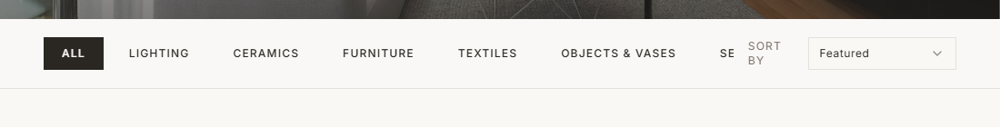
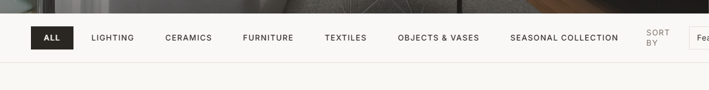
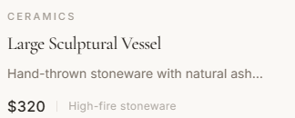
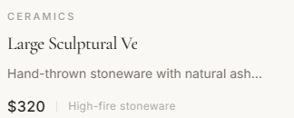
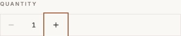
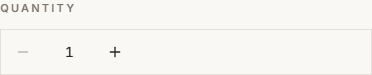
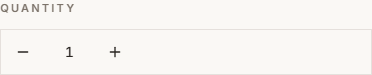
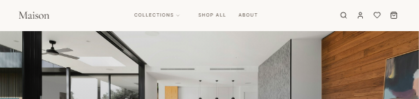
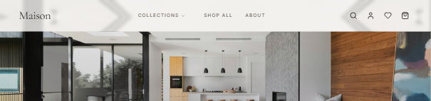

# UI 결함 (U)

`server/bugs/ui.ts` 에 등록된 다섯 건의 증상과 확인 방법이다. 전부
`src/styles/bugs-ui.css` 한 파일에서 만든다. 컴포넌트를 고치지 않으므로
다른 분야의 작업과 겹치지 않는다.

```sh
npm run dev                  # 정상
BUGS_ON=all npm run dev      # 다섯 건 전부
BUG_U2=1 npm run dev         # 한 건만
```

사진은 전부 창 너비 1100px 에서 **한 건씩만 켜고** 찍었다. 여러 건을 같이
켜면 증상이 겹쳐서 원인을 가릴 수 없다 (아래 "겹침 주의" 참고).

## 무엇을 UI 결함으로 보는가

필요한 정보를 못 읽게 하거나 조작을 방해하는 표시 문제만 넣는다. 보기
좋고 나쁨은 제외한다. 가림 · 잘림 · 겹침 · 누락이 기준이다.

---

## U1 — 가로 스크롤이 생겨 오른쪽이 잘림

본문 영역이 1280px 아래로 줄어들지 않는다. 창이 그보다 좁으면 넘치는
만큼이 오른쪽 밖으로 나가고 가로 스크롤바가 생긴다.

| 정상 | 결함 |
|---|---|
|  |  |

정렬 상자가 `Featured` 에서 `Fea` 로 잘렸다. 헤더 오른쪽의 계정·위시리스트·
장바구니 아이콘도 화면 밖으로 밀려난다.

```js
document.documentElement.scrollWidth > window.innerWidth   // 1280 > 1100
```

**이 한 건만 규칙으로 잡힌다.** 다섯 건이 전부 안 잡히면 탐지기 자체를
의심해야 하는데, 이 건이 그 의심을 걷어주는 대조군이다.

## U2 — 상품 이름이 줄임표 없이 잘림

이름이 한 줄로 고정되고 넘치는 부분이 사라진다. `...` 이 없어서 잘렸다는
사실 자체를 알 수 없다.

| 정상 | 결함 |
|---|---|
|  |  |

`Large Sculptural Vessel` 이 `Large Sculptural Ve` 가 된다. 13개 중 10개가
잘리고, 짧은 이름(`Orb Table Lamp`)은 멀쩡해서 더 헷갈린다.

```js
[...document.querySelectorAll('article h3')]
  .filter(el => el.scrollWidth > el.clientWidth).length   // 0 -> 10
```

폭 제한을 `%` 가 아니라 `ch` 로 준 이유: `%` 는 카드 폭에 비례해서 창을
좁히면 (열 수가 줄어 카드가 넓어져) 증상이 사라진다. 재현성이 필요하다.

## U3 — 키보드 포커스 표시가 보이지 않음

`Tab` 으로 이동해도 지금 어느 요소에 있는지 화면에 나타나지 않는다.
포커스는 실제로 옮겨간다. 눈에만 안 보인다.

| 정상 | 결함 |
|---|---|
|  |  |

정상은 `+` 버튼에 테두리가 그려지고, 결함에서는 아무 표시가 없다.

```js
el.focus();
const s = getComputedStyle(el);
[s.outlineStyle, s.boxShadow]   // ["solid", "rgb(...) 0 0 0 2px"] -> ["none", "none"]
```

**스크린샷만으로는 판정할 수 없다.** 포커스가 가지 않은 화면과 똑같이
생겼다. `Tab` 을 눌러보고 그 순간의 계산된 스타일을 봐야 한다.

## U4 — 누를 수 없는 버튼이 누를 수 있어 보임

`disabled` 상태인데 흐려지지 않고 손가락 커서까지 떠서 평소 버튼과
구분되지 않는다. 눌러도 아무 일이 없는데 왜 안 되는지 알 수 없다.

| 정상 | 결함 |
|---|---|
|  |  |

수량이 1일 때 `−` 버튼이 정상에서는 흐리고, 결함에서는 `+` 와 똑같이
진하다.

```js
[el.disabled, getComputedStyle(el).opacity]   // [true, "0.3"] -> [true, "1"]
```

**F3(수량 조절 무반응)과 겉보기 증상이 같다.** 둘 다 "눌렀는데 반응 없음"
이다. 가르려면 `el.disabled` 를 봐야 하고, 안 보면 UI 결함을 기능 결함으로
분류한다. 채점할 때 "탐지 성공 / 분류 실패" 로 따로 세는 편이 정확하다.

## U5 — 상단 헤더가 본문 첫 부분을 덮음

헤더가 문서 흐름에서 빠져 본문 위에 뜬다. 모든 화면에서 위쪽 81px 이
가린다. 가려진 자리는 클릭도 헤더가 가져간다.

| 정상 | 결함 |
|---|---|
|  |  |

결함 쪽은 헤더가 반투명이라 뒤의 사진이 비쳐 보인다.

```js
const h = document.querySelector('header').getBoundingClientRect();
const m = document.querySelector('main').getBoundingClientRect();
[getComputedStyle(document.querySelector('header')).position, m.top < h.bottom]
// ["sticky", false] -> ["fixed", true]
```

`sticky` 를 `fixed` 로 바꾸는 건 실무에서 흔한 실수다. 둘이 비슷해 보이는데
흐름에서 빠지는지가 다르다.

---

## 확인 절차 요약

| ID | 어디서 | 무엇을 하면 | 무엇을 보면 잡히나 |
|---|---|---|---|
| U1 | 아무 화면 | 창을 1280px 미만으로 | `scrollWidth > innerWidth` |
| U2 | `/products` | 카드 목록을 봄 | `h3` 의 `scrollWidth > clientWidth` |
| U3 | 아무 화면 | `Tab` 을 누름 | 포커스는 이동하는데 `outline`·`box-shadow` 가 `none` |
| U4 | `/product/arc-pendant-light` | 수량 `−` 를 봄 | `disabled` 인데 `opacity: 1` |
| U5 | 아무 화면 (맨 위) | 스크롤 0 에서 봄 | `header.position === "fixed"` 이고 `main.top < header.bottom` |

U3 만 조작(`Tab`)이 필요하고 나머지 넷은 보기만 해도 잡힌다.

## 겹침 주의

여러 건을 같이 켜면 증상이 서로 영향을 준다. 측정할 때 중복 집계의
원인이 되므로 알아둬야 한다.

- **U1 + U5** — 헤더가 1280px 로 고정된 채 떠서, 창이 1100px 이면 오른쪽
  아이콘 세 개가 화면 밖으로 사라진다. 이걸 별개의 결함으로 세기 쉽지만
  U1 의 파생 증상이다.
- **U1 + U2** — U1 이 본문을 넓히므로 카드도 넓어진다. U2 의 폭 제한을
  `%` 로 뒀다면 여기서 증상이 사라졌을 것이다. `ch` 로 둬서 영향받지 않는다.

한 건씩 켜서 확인한 뒤 전부 켠 상태를 보는 순서가 안전하다.

## CSS 로 만들 수 없는 것

조건부로 렌더링되는 요소는 사라진 뒤 CSS 로 되살릴 수 없다. 예를 들어
"로딩 스켈레톤이 안 사라진다" 는 아래처럼 갈라지므로 여기서 만들 수 없고
컴포넌트를 고쳐야 한다.

```jsx
{isPending ? <ProductGridSkeleton count={8} /> : <ProductGrid … />}
```

처음에 이 건을 U5 로 잡았다가 같은 이유로 헤더 가림으로 바꿨다.
